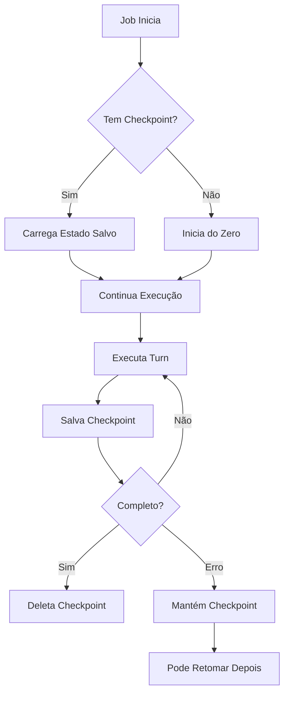

# ✅ Sistema de Checkpoints - Implementação Completa

## 📋 Resumo

Implementei um **sistema completo de checkpoints** que permite salvar e retomar o estado do agente caso a sessão caia ou pare. O agente agora pode continuar de onde parou sem perder progresso!

## 🎯 O Que Foi Implementado

### 1. Core do Sistema de Checkpoints

**Arquivo**: [`src/agent/checkpoint.ts`](src/agent/checkpoint.ts)

- ✅ `CheckpointManager` - Gerenciador principal
- ✅ Salvamento automático no Redis
- ✅ TTL de 7 dias
- ✅ Versionamento de checkpoints
- ✅ Metadados completos

**O que é salvo:**
- Histórico completo de mensagens
- Número de turns executados
- Modelo LLM selecionado
- Configuração do workspace
- Conteúdo de raciocínio (DeepSeek thinking mode)
- Timestamp da última atualização

### 2. Integração com o Agent Loop

**Arquivo**: [`src/agent/loop.ts`](src/agent/loop.ts)

- ✅ Carrega checkpoint automaticamente ao iniciar
- ✅ Salva checkpoint após cada resposta da LLM
- ✅ Salva checkpoint após execução de ferramentas
- ✅ Limpa checkpoint ao completar com sucesso
- ✅ Parâmetro `resumeFromCheckpoint` para controle manual

### 3. API REST Completa

**Arquivo**: [`src/api/routes/checkpoint.ts`](src/api/routes/checkpoint.ts)

Endpoints disponíveis:

| Método | Endpoint | Descrição |
|--------|----------|-----------|
| GET | `/checkpoints` | Lista todos os checkpoints ativos |
| GET | `/checkpoints/:jobId` | Obtém metadados de um checkpoint |
| GET | `/checkpoints/:jobId/can-resume` | Verifica se pode retomar |
| POST | `/checkpoints/:jobId/resume` | Retoma execução de onde parou |
| DELETE | `/checkpoints/:jobId` | Deleta checkpoint manualmente |

### 4. Scripts de Gerenciamento

**Arquivos**: [`test/scripts/`](test/scripts/)

```bash
# Listar todos os checkpoints ativos
npm run test:checkpoints

# Retomar job específico
npm run test:resume <jobId>

# Inspecionar checkpoint em detalhes
npm run test:inspect <jobId>
npm run test:inspect <jobId> --verbose
```

### 5. Testes E2E

**Arquivo**: [`test/e2e/checkpoint-resume.test.ts`](test/e2e/checkpoint-resume.test.ts)

- ✅ Criação e carregamento de checkpoints
- ✅ Preservação do histórico de mensagens
- ✅ Preservação de tool calls
- ✅ Preservação de reasoning content
- ✅ Metadados e deleção
- ✅ Atualização incremental

### 6. Processador de Jobs

**Arquivo**: [`src/jobs/processor.ts`](src/jobs/processor.ts)

- ✅ Suporte a flag `_resume` para retomar jobs
- ✅ Copia checkpoint do job antigo para o novo
- ✅ Logging de retomadas

## 🚀 Como Usar

### Cenário 1: Job Falha Automaticamente

```bash
# 1. Job falha (rate limit, erro de API, etc)
# Checkpoint é salvo automaticamente

# 2. Verificar checkpoints disponíveis
npm run test:checkpoints

# 3. Retomar execução
npm run test:resume <jobId>
```

### Cenário 2: Via API REST

```bash
# Verificar se pode retomar
curl http://localhost:3000/checkpoints/123/can-resume

# Retomar
curl -X POST http://localhost:3000/checkpoints/123/resume \
  -H "Content-Type: application/json" \
  -d '{"callback": {"url": "https://webhook.site/..."}}'
```

### Cenário 3: Programaticamente

```typescript
import { checkpointManager } from './src/agent/checkpoint.js';

// Verificar checkpoint
const checkpoint = await checkpointManager.loadCheckpoint(jobId);
console.log(`Job pode retomar do turn ${checkpoint.turns}`);

// Listar todos
const active = await checkpointManager.listActiveCheckpoints();
```

## 📊 Fluxo de Execução



## 📁 Estrutura de Arquivos

```
src/
├── agent/
│   ├── checkpoint.ts          # ⭐ Core do sistema de checkpoints
│   └── loop.ts                # ✏️ Modificado para usar checkpoints
├── api/
│   ├── routes/
│   │   └── checkpoint.ts      # ⭐ API REST para checkpoints
│   └── server.ts              # ✏️ Registra rotas de checkpoint
└── jobs/
    └── processor.ts           # ✏️ Suporte a retomar jobs

test/
├── e2e/
│   └── checkpoint-resume.test.ts  # ⭐ Testes E2E
└── scripts/
    ├── list-checkpoints.ts    # ⭐ Script para listar
    ├── resume-checkpoint.ts   # ⭐ Script para retomar
    └── inspect-checkpoint.ts  # ⭐ Script para inspecionar

docs/
├── CHECKPOINT_SYSTEM.md       # ⭐ Documentação completa
└── CHECKPOINT_EXAMPLES.md     # ⭐ Exemplos práticos
```

**Legenda:**
- ⭐ Arquivo novo
- ✏️ Arquivo modificado

## 🔧 Configuração

Não há configuração adicional necessária! O sistema usa o Redis já configurado:

```env
REDIS_URL=redis://localhost:6379
```

## 🧪 Testar a Implementação

### 1. Executar testes

```bash
npm run test:e2e checkpoint-resume
```

### 2. Teste manual

```bash
# Terminal 1: Iniciar servidor
npm run dev

# Terminal 2: Iniciar worker
npm run dev:worker

# Terminal 3: Criar job que pode falhar
curl -X POST http://localhost:3000/webhook ...

# Monitorar
npm run test:monitor <jobId>

# Se falhar, retomar
npm run test:resume <jobId>
```

## 📈 Benefícios

### ✅ Resiliência
- Jobs não perdem progresso em falhas
- Retry inteligente com contexto preservado
- Reduz desperdício de tokens da LLM

### ✅ Debugging
- Inspeciona estado completo do agente
- Visualiza histórico de mensagens
- Identifica onde falhou

### ✅ Custo
- Não repete trabalho já feito
- Economiza chamadas à API da LLM
- Otimiza uso de recursos

### ✅ Confiabilidade
- Sobrevive a crashes do servidor
- Lida com rate limits graciosamente
- Permite manutenção sem perda de trabalho

## 🔐 Segurança e Limpeza

### Limpeza Automática
- ✅ Checkpoints expiram após 7 dias (TTL do Redis)
- ✅ Deletados automaticamente ao completar com sucesso
- ✅ Podem ser deletados manualmente via API

### Dados Armazenados
- Tudo fica no Redis (já configurado)
- Não há arquivos no disco
- Não há dados sensíveis além do que já está nos jobs

## 📚 Documentação

- **[CHECKPOINT_SYSTEM.md](docs/CHECKPOINT_SYSTEM.md)** - Documentação técnica completa
- **[CHECKPOINT_EXAMPLES.md](docs/CHECKPOINT_EXAMPLES.md)** - Exemplos práticos de uso
- Este arquivo - Resumo da implementação

## 🎯 Próximos Passos Opcionais

### Melhorias Futuras (não implementadas ainda)

1. **Compressão**: Comprimir checkpoints grandes para economizar Redis
2. **Histórico**: Manter múltiplos checkpoints por job
3. **Auto-retry**: Configurar retry automático usando checkpoints
4. **Dashboard**: Interface web para gerenciar checkpoints
5. **Métricas**: Rastrear taxa de retomada vs. falha

### Como Adicionar

Essas melhorias são opcionais. O sistema atual já está **100% funcional** e pronto para uso!

## ✨ Status

**Status**: ✅ **Implementação Completa e Pronta para Uso**

- ✅ Core implementado
- ✅ API REST implementada
- ✅ Scripts de gerenciamento
- ✅ Testes E2E
- ✅ Documentação completa
- ✅ Exemplos práticos

## 🤝 Como Contribuir

Se quiser adicionar melhorias:

1. Leia a documentação em [CHECKPOINT_SYSTEM.md](docs/CHECKPOINT_SYSTEM.md)
2. Execute os testes: `npm run test:e2e checkpoint-resume`
3. Adicione novos testes para novas funcionalidades
4. Atualize a documentação

---

## 💡 Dúvidas?

Consulte:
- [Documentação Técnica](docs/CHECKPOINT_SYSTEM.md)
- [Exemplos Práticos](docs/CHECKPOINT_EXAMPLES.md)
- [Testes E2E](test/e2e/checkpoint-resume.test.ts)

---

**Desenvolvido com ❤️ para maior resiliência e confiabilidade do AI Coder**
